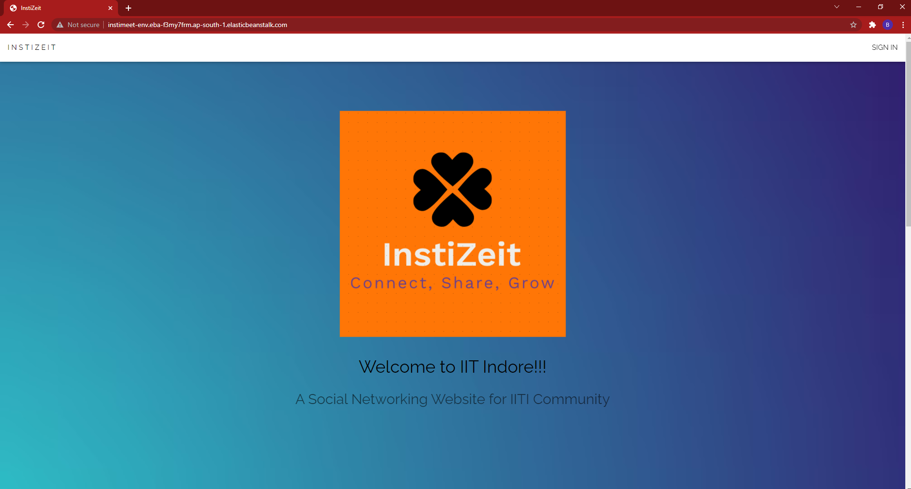
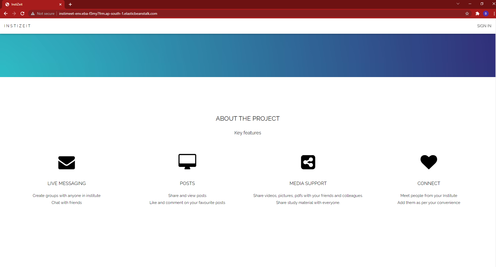
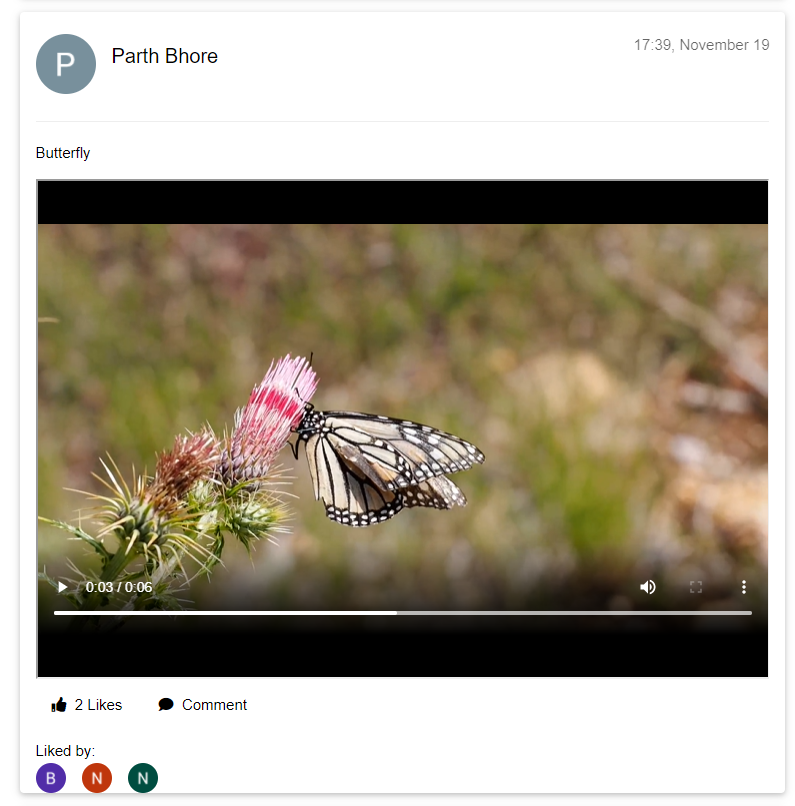
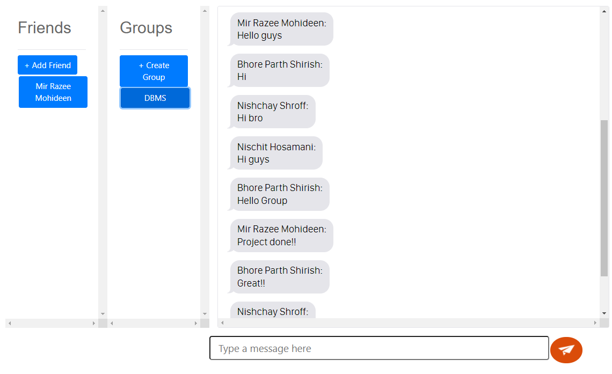
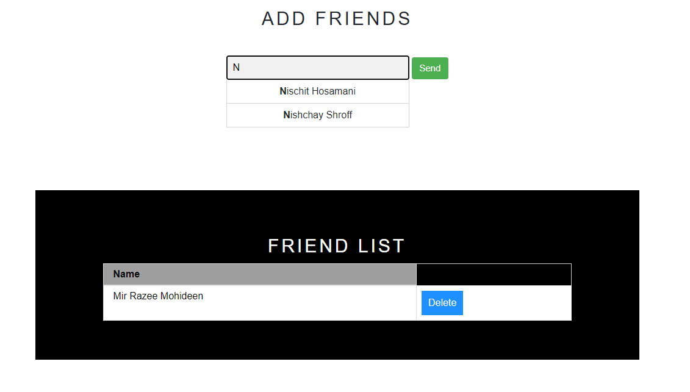
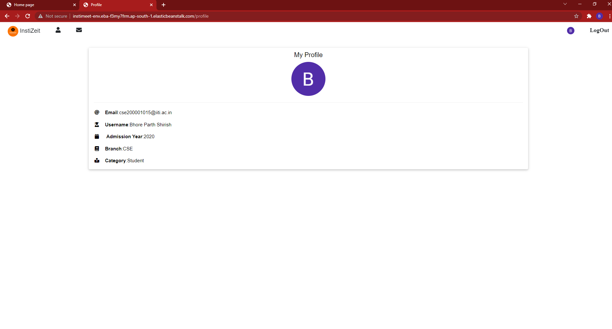
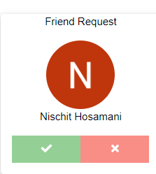

# Instizeit
About our project: InstiZeit is a Social Networking Website for
IITI Community  
Key Features: Real Time Messaging, Connect with Friends using
Auto-Recommendation, Add Posts with Image, Video and PDF
Support.  
Project Structure: 
Front-end: HTML, CSS, JS 
Backend: Python-Flask 
Database: MySQL. SQLAlchemy is used to connect Database
with python-flask and execute queries. 
Hosting: AWS Elastic Beanstalk with Amazon RDS remote
Database 
API: Google O-Auth API for Sign-In and User Verification 
Google Drive API for uploading and accessing media files  

  Landing Page
  

  

 

  Posts
  

 

  Live Messaging
  

 

  Add Friends
  

 

  Profile page
  

 Friend Requests 

  

  

Hosted website: http://instimeet-env.eba-f3my7frm.ap-south-1.elasticbeanstalk.com/ 
(Hosted Website may crash due to Server Overload or Connection Timeout. Currently working on resolving these issues)

Running on localhost: 
• Create Virtual Environment and install required libraries
using: 
• pip install -r requirements.txt 
• Send request for .env file containing API keys  
• To run application: Use python application.py

Developed in collaboration with Nishchay Shroff, Mir Razee Mohideen and Nischit Hosamani 

